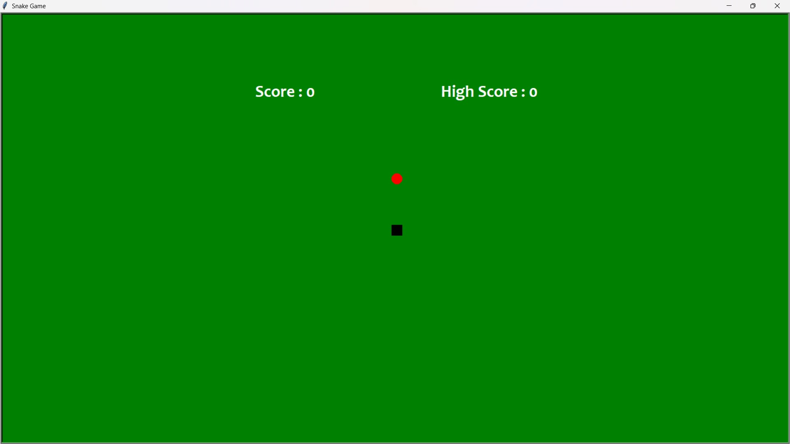
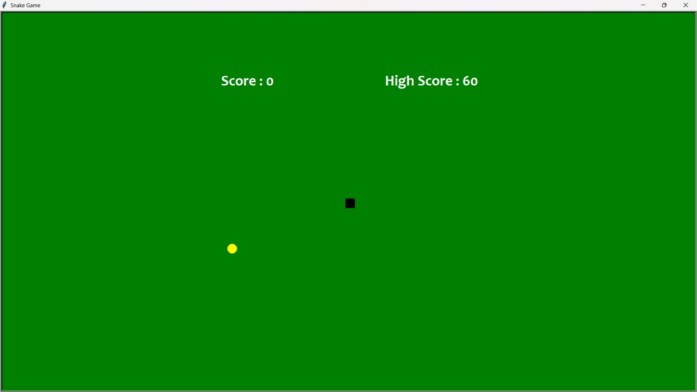

<h1 align="center">🐍 Snake Game</h1>

<p align="center">
Classic Snake Game built using Python Turtle
</p>

<p align="center">
  <a href="https://github.com/Somya6422/snake-game/releases">
    
  </a>
</p>

---

## About the Project

This project is a classic **Snake Game** built using **Python Turtle graphics**.

The player controls a snake that grows longer each time it eats food.  
The objective is to score as many points as possible while avoiding collisions with the walls or the snake's own body.

This project demonstrates:

- Basic game development using Python
- Keyboard event handling
- Collision detection
- Score tracking
- Simple GUI with Turtle graphics

---

## Platform

The downloadable build provided in **Releases** is for:

**Windows Operating System**

Download the ZIP file, extract it, and run the `.exe` file to start the game.

---

## Controls

| Key | Action |
|----|------|
| W | Move Up |
| S | Move Down |
| A | Move Left |
| D | Move Right |

---

## How to Play

1. Download the latest version from the **Releases** section.
2. Extract the ZIP file.
3. Run the `.exe` file.
4. Use the keyboard controls to move the snake.
5. Eat food to increase your score.
6. Avoid hitting the wall or your own body.

---

## Game Screenshots

<p align="center">
  
  
</p>

<p align="center">
  
  
</p>

---

## Features

- Classic Snake gameplay
- Score tracking
- High score system
- Collision detection
- Restart after game over
- Smooth snake movement
- Simple and intuitive controls

---

## Run the Game from Source Code

If you want to run the game directly from Python instead of the executable:

### Requirements

- Python 3.x

### Run the game

```bash
python snake_game.py
